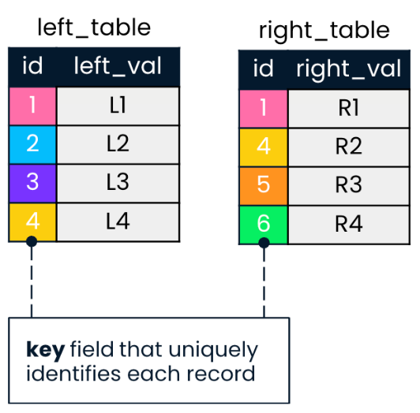
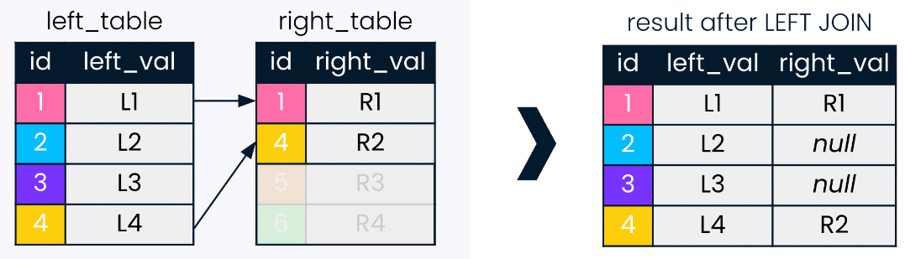

# Joining data in SQL

## Summary
| Keyword | Use |
| ---: | :--- |
| INNER JOIN | returns the data that matches on a given field in all the tables |
| USING | used to specify the column on which the JOIN is made **when the columns have the same name in all tables** |
| ON | used to specify the columns on wich the JOIN is being made |
| LEFT JOIN | returns all the values from the selected table even if there is not a matching value in the joined table |
| RIGHT JOIN | returns all the values that match the joined table despite a left record not having a match |
| CROSS JOIN | returns all the possible combinations between the selected fields from the tables |
| UNION | concatenates all the records in both tables *removing duplicates* |
| UNION ALL | concatenates all the records in both tables *including duplicates* |
| INTERSECT | returns all the records that exist in both tables |
| EXCEPT | returns all records from the left table that don't exist in the right table |

<br />

## Requirements

When working with JOINS, we have to have in mind that we're working with tables
that hold a relationship through one (or more) of their columns. 

For example, in the image below, we have two tables: *left_table* and 
*right_table*; both are connected throug the *id* column. 



*NOTE that JOIN is executed after the FROM statement.*

## INNER JOIN

INNER JOIN looks for records in botth tables wich match on a given field. 

For example, the following query would produce the output below:

```sql
-- INNER JOIN with ON
SELECT lt.id, lt.left_val, rt.right_val -- alias followed by '.field_name'
FROM left_table AS lt -- giving an alias to the table to reference fields
INNER JOIN right_table AS rt
ON lt.id = rt.id;

-- With the USING command (check condition)
SELECT lt.id, lt.left_val, rt.right_val -- alias followed by '.field_name'
FROM left_table AS lt -- giving an alias to the table to reference fields
INNER JOIN right_table AS rt
USING (id); -- CONDITION: when the column names are identical
```

Diagram of **INNER JOIN ON** the **id** field


NOTE that an alias was given to each table to reference the fields in the SELECT
statement.

## Types of relationships

| Relationship type | Description | Example |
| --- | --- | --- |
| One-to-many | many records of one table map to only one record in another table | artist to songs |
| One-to-one | unique field to unique field | finger to fingerprint |
| Many-to-many | many records of one table map to many reocrds in another | countries to languages |

## Multiple JOINS

We might need to join more than 2 tables.

```sql
SELECT *
FROM left_table
INNER JOIN right_table
ON left_table.id = right_table.id
INNER JOIN another_table
ON right_table.id = another_table.id; -- depending on the case, any of the 
                                      -- previous tables can be used here
```
NOTE that, depending on the case, left_table or right_table can be used in the
*ON* clause for the second *JOIN*. 

### Joining multiple keys

We can limit the number of records returned by supplying an additional field
to join on by adding the *AND* keyword on our *ON* clause. 

```sql
SELECT *
FROM left_table
INNER JOIN right_table
ON left_table.id = right_table.id
    AND left_table.id_2 = right_table.id_2;
```

<br />

# Outer, cross and self JOINS

## LEFT JOIN

**LEFT JOIN** will return all records in the left table and those records in
the right table that match on the joining field provided. It gives null values
to the records that don't match (see image below).

```sql
SELECT lt.id, lt.left_val, rt.right_val
FROM left_table AS lt
LEFT JOIN right_table AS rt -- can also be written as LEFT OUTER JOIN
ON lt.id = rt.id;
```

Diagram of **LEFT JOIN ON** the **id** field



## RIGHT JOIN

These are not used as often as the previous one, it acts as the **LEFT JOIN** 
but in reverse, it will keep all records in the right table but return only 
those from the left table that match in the given field. 

It has the same syntax, just need to replace *LEFT* with *RIGHT*.

Diagram of **RIGHT JOIN ON** the **id** field


## FULL JOINS

**FULL JOIN** is the last out of the three types of *OUTER JOINS*, it combines
LEFT and RIGHT join and returns all the records, irrespective of wether they
have a match in the other table being joined.

Same syntax, just adapt our query to have the word **FULL** before **JOIN** 
instead of the others.

Diagram of **FULL JOIN ON** the **id** field


## CROSS JOINS

**CROSS JOIN** craetes all possible combinations of two tables. 

In the diagram below we have two tables with one field each. Each of them have
three records, therefore a **CROSS JOIN** will return all 9 possible
combinations between the fields. 

Diagram of **CROSS JOIN**


The syntax of the **CROSS JOIN** is very minimal and does not specify **ON**
which field it to make the join. 

```sql
SELECT id1, id2
FROM table1
CROSS JOIN table2;
```

## SELF JOIN

This is a special kind of JOIN where the table is *joined with itself*.

**SELF JOINS** are used to compare values from part of a table to other values
from within the same table.

*Example*: We have a prime_ministers table with country and continent fields. We
want to create a table showing all countries in the same continent as pairs to 
know how the prime ministers' continental meetings should be arranged.

```sql
SELECT 
    p1.country AS country1
    p2.country AS country2
    p1.continent
FROM prime_ministers AS p1
INNER JOIN prime_ministers AS p2
ON p1.continent = p2.continent
LIMIT 10;
```

As we can see in the example above, **SELF JOINS** don't have a dedicated
syntax, aliasing is required. It is vital to JOIN the table **ON** the fields
which we want to use to match the table to itself.

<br />

# Set theory for SQL Joins

SQL has three main set operations **UNION**, **INTERSECT** and **EXCEPT**.S


## UNION & UNION ALL

In SQL, **UNION** is used for concatenating tables. It takes 2 or more **SELECT**
statements and output them together. 

* Both tables must have the same number of fields and they have to share the 
same datatype. 
* **UNION**.- If two records are identical, UNION only returns them once
* **UNION ALL**.- It will return duplicate records


### SQL Syntax

```sql
-- UNION
SELECT *
FROM left_table
UNION
SELECT *
FROM right_table

-- UNION ALL
SELECT *
FROM left_table
UNION ALL
SELECT *
FROM right_table
```

## INTERSECT

Takes two tables as input, and returns only the records that exist in both 
tables.

* As UNION, it requires fields to match
* Doesn't return duplicate *records* (a row being a record)
* **INNER JOIN**.- you can do the same with *INNER JOIN* but with the latter
duplicate values will be returned

```sql
-- INTERSECT
SELECT *
FROM left_table
INTERSECT
SELECT *
FROM right_table
```

## EXCEPT

Returns the records that are present in the left table but *not in the right*
*table*.

* As UNION, it requires fields to match

```sql
-- INTERSECT
SELECT *
FROM left_table
EXCEPT
SELECT *
FROM right_table
```

<br />

# Subqueries

## Semi-join and anti-join

So far we've worked with additive joins (meaning it adds data from another table
where there's a match on some field). 

**SEMI JOINS** are used to choose records in the first table where a condition
is met in the second table; using the **WHERE** clause and a **SUBQUERY** (as
shown in the example below).

```sql
-- Semi-join using a subquery
SELECT col1
FROM left_table
WHERE col1 IN
    (SELECT col2        -- Start of subquery
    FROM right_table);

-- Anti-join using a subquery
SELECT col1
FROM left_table
WHERE col1 NOT IN       -- we just add NOT before the IN keyword
    (SELECT col2 
    FROM right_table);
```

### Diagram of semi-join


### Diagram of anti-join


## Subqueries inside WHERE, SELECT and FROM

### WHERE IN

The semi-join and anti-join are both examples of *SUBQUERIES using WHERE ON*,
where inside the **WHERE** clause we can filter one field with a query from
another table; the only condition would be for the subquery result to be the
same datatype as the field we're filtering on. 

### SELECT

We can use a subquery in the SELECT statement of a query instead of a JOIN and
GROUP BY when using aggregate functions. 

```sql
-- Query that returns the continents and the number of monarchs they have
-- using 2 separate tables
SELECT DISTINCT continent,
    (SELECT COUNT(*)
    FROM monarchs
    WHERE states.continent = monarch.continent) AS monarch_count
FROM states;
```

### FROM

We can include multiple tables in our **FROM** clause:

```sql
SELECT left_table.id, left__val
FROM left_table, right_table
WHERE left_table.id = right_table.id
```

This would work as an **INNER JOIN** but would keep duplicate values. We could 
use **DISTINCT** to remove duplicates. 

```sql
SELECT DISTINCT left_table.id, left__val
FROM left_table, right_table
WHERE left_table.id = right_table.id
```

With this in mind, we can use subqueries in the **FROM** statement to filter
records. *Example:*

```sql
-- Query to return continents with monarchs and the year of the most recent
-- country gained independence
SELECT DISTINCT monarchs.continent, sub.most_recent
FROM 
    monarchs,
    (SELECT
        continent, 
        MAX(indep_year) AS most_recent
    FROM states
    GROUP BY continent) AS sub
WHERE monarchs.continent = sub.continent
```

<br />

### Final Chapter Excercise
```sql
-- Select fields from cities
SELECT 
    name, 
    country_code, 
    city_proper_pop, 
    metroarea_pop, 
    city_proper_pop / metroarea_pop * 100 AS city_perc
FROM cities
-- Use subquery to filter city name
WHERE name IN
    (SELECT capital
    FROM countries
    WHERE continent = 'Europe' OR continent LIKE '%America')
-- Add filter condition such that metroarea_pop does not have null values
    AND metroarea_pop IS NOT null
-- Sort and limit the result
ORDER BY city_perc DESC
LIMIT 10;
```