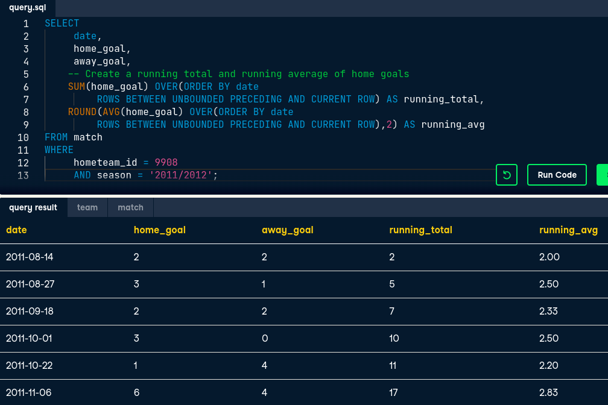

# Data Manipulation in SQL

This course covers how to shape, transform and manipulate data using:

* CASE statements
* Simple subqueries
* Correlated subqueries
* Window functions

<br />

## Summary

| Keyword | Use |
| ---: | :--- |
| CASE | *if-else* statement in SQL, allows to return different values upon given conditions |
| WHEN *condition* THEN *result* | part of the CASE statement where we set the condition and the value to return |
| ELSE | final part of the CASE statement, returns the default value if no condition is met, defualts to *null* |
| END | keyword used to close a CASE statement, goes at the end of it | 
| OVER() | window function, tells SQL to pass an aggregate value *over* the existing result set, i.e. repeat this scalar value (produced by the aggregate function) in all rows |
| RANK() | creates a column numbering the data set form the *highest to lowest* or from *lowest to highest* (default) | 
| PARTITION BY | window function used inside of OVER(), allows to perform the same function over the data but specifying what group of values it will be applied on 

<br />

# CASE statements

* In SQL, CASE statements work as a *if-then-else* clause in other programing
languages.
* **CASE** statements are written inside the **SELECT** clause and have the 
following syntax:
    1. WHEN
    2. THEN
    3. ELSE
    4. END
* They can have multiple conditions using the keywords AND and OR
* We can also use **CASE** statements in the **WHERE** clause to filter data but
note that since **WHERE** is executed first, we'd have to repeat the same code
on the **SELECT** statemet.

```sql
-- Query to see x relationship towards y
SELECT
    num_x,
    num_y,
    CASE WHEN num_x > num_y THEN 'x bigger than y'
         WHEN num_y < num_y THEN 'x smaller than y'
         ELSE 'x and y are the same' AS result
FROM numbers;

-- CASE with multiple conditions to see if a team won or lose their matches
SELECT match_date, hometeam_id, awayteam_id,
    CASE WHEN hometeam_id = 8455 AND home_goal > away_goal
        THEN 'Madrid home win!'
    CASE WHEN away_id = 8455 AND home_goal < away_goal
        THEN 'Madrid away win!'
    ELSE 'Loss or tie' END AS outcome
FROM matches
WHERE hometeam_id = 8455 OR awayteam_id = 8455 -- important to filter only
                                               -- Madrid matches
```

### CASE statements with aggregate functions

We can also use a **CASE** statement to aggregate data based on the result of a
logical test. In the example below we take advantage that **ELSE** defaults to 
*null* to count the ocurrences of an event (*null* values aren't counted)

```sql
-- Count the wins of a team in a season
SELECT 
    season, 
    COUNT(CASE WHEN hometeam_id = 8650 AND home_goal > awaygoal
            THEN id END) AS home_wins,
    COUNT(CASE WHEN away_id = 8650 AND home_goal < awaygoal
            THEN id END) AS away_wins
FROM matches
GROUP BY season;
```
NOTE: In other languages such as Python and R, we can sum *boolean* values, in
SQL we have to use a **CASE** statement to return 1 and 0 after a logical test
and wrap it on a **SUM()** function.

<br />

# Subqueries

## Simple subquery

A query *nested* inside another query, that can be run on its own. 

* Useful for intermediary transformations
* It is evaluated only once in the entire statement, *i.e.*, SQL processes first
the subquery and then moves on to the query. 

### What can it do?

* Can be placed in any part of a query (SELECT, FROM, WHERE, GROUP BY)
* Can return a variety of information
    * Scalar quantities
    * Lists
    * Table

### Why to use it

* Comparing groups to summarized values
* Reshaping data
* Combining data that cannot be joined

## Subqueries in WHERE

Allows us to filter information, gives us the advantage to use information from
different tables without joining them, or even if they don´t hold a direct
relationship. 

```sql
-- Return all scores higher than the average score from group A
SELECT group, score
FROM scores
WHERE 
    num > (SELECT AVG(num)
        FROM scores
        WHERE group = 'A')

-- Return the student names that don't belong to group B using 2 tables
SELECT id, student_name
FROM students
WHERE id NOT IN
    (SELECT id
    FROM groups
    WHERE group != 'B')
```

## Subqueries in FROM

* Restructure and transform your data: 
    * we might want to transfrom data from long to wide before selecting
    * prefiltering data
* Calculating *aggregates of aggregates*
    * finding the max average of a field grouped by another field.
* You can create multiple subqueries in one **FROM** statement, but you have to
*alias them and have a column to join them*

```sql
/* Return country and number of matches for countries with matches with 10 or
more goals.*/
SELECT
	-- Select country name and the count match IDs
    name AS country_name,
    COUNT(c.id) AS matches
FROM country AS c
-- Inner join the subquery onto country
-- Select the country id and match id columns
INNER JOIN (SELECT country_id, id 
           FROM match
           -- Filter the subquery by matches with 10+ goals
           WHERE (home_goal + away_goal) >= 10) AS sub
ON c.id = sub.country_id
GROUP BY country_name;
```

## Subqueries in SELECT

* Used to return a signle aggregate value
    * Include aggregate values to compare to individual values
* Used in mathematical calculations
    * Deviation from the average

```sql
-- Get the deviation from the average
SELECT
    id,
    record_value,
    (record_value -
        (SELECT AVG(record_value)
        FROM observations)) AS deviation
FROM observations
```

## Best practices

* Properly line up our quries (indentation)
* Use comments:
```sql
/* BLOCK OF COMMENT: this comment can be in
more than one line */

-- Single line comments
```
* Use casing (CAPITALIZE keywords)

NOTE: **Holywell's SQL Style Guide** for all the formatting conventions.

### Remember that:

Subqueries require computing power so we should consider:

* How big is the database?
* How big is the table we're querying from
* Is the subquery actually necessary

<br />

# Correlated subqueries, nested subqueries and common table expressions

## Correlated subqueries

Special kind of subquery that 

* *Uses values from the outer query* to generate a result.
* The subquery ir re-executed each time a new row in th efinal data set is
returned
* They are used for advanced types of calculations such as advanced joining,
filtering and evaluating of data in the database

### Key differences between a simple and correlated subqueries

| Simple Subquery | Correlated Subquery |
| --- | --- |
|Can be run *independently* from the main query | *Dependent* on the main query |
| Evaluated once in the whole query | Evaluated in loops (reduces performance) |

```sql
-- Example without correlated subquery
SELECT
    c.name AS country,
    AVG(m.home_goal + m.away_goal) AS avg_goals
FROM countries AS c
LEFT JOIN matches_table AS m
ON c.id = m.country_id
GROUP BY country

-- Correlated query example
SELECT
    c.name AS country
    (SELECT
        AVG(home_goal + away_goal
    FROM matches_table AS m
    WHERE m.country_id = c.id)) AS avg_goals -- Subquery referencing countries
FROM countries as c
GROUP BY country
```

## Nested subqueries

Subqueries can be nested inside other subqueries (being correlated or simple).

```sql
SELECT student
FROM 
    (SELECT student_name as student -- First subquery
    FROM school_records
    WHERE group_id IN
        (SELECT id                  -- Second subquery
        FROM groups
        WHERE group_code = 'A')) as subq
```

## Common table expressions

Common table expressions (CTE) are a common method for improving readability and
accessibility of information in subqueries. 

* CTEs are a special type of *subquery declared before* of the main query. 
* *Named* and *referenced* later in FROM statemet
* Used the keyword **WITH** to be declared (see syntax in the code box below)

### Benefits

* CTE is executed once and stored in memory
* Improves query performance
* Improves organization of queries
* You can reference other CTEs, *i.e.* if we have 3 CTEs, the second an third
can retrieve information from the first one.
* It can reference itself (SELF JOIN), in a special kind of table called a
*recursive CTE*.

```sql
-- CTE Syntax
WITH s1 AS(
    /* subquery 1 body */
),
s2 AS(                              -- add a second subquery
    /* subquery 2 body */
)

-- Example
WITH cte AS(                        -- creating a common table expression
    SELECT student_name as student
    FROM school_records
    WHERE group_id IN
        (SELECT id 
        FROM groups
        WHERE group_code = 'A') as subq
)

SELECT student
FROM cte
```

## Which technique to use?

### Joins

* Combine 2+ tables
    * Simple operations/aggregations

### Correlated subqueries

* Match subqueries & tables
    * Avoid limit of joins
    * DISADVANTAGE: High processing time

### Multiple/nested subqueries

* Multi-step transformations
    * Improve accuracy and reproducibility

### Common table expressions

* Organize subqueries sequentially
* Can reference other CTEs

<br />

# Window functions

One limitation we have so far is that we can't use aggregate functions without
grouping results. We can work around this limitation using a **window function**.

**Window functions** are a class of functions that perform calculations on a
result set that has already been generated, also refered as a "window". Window
functions allow to perform agggregate calculations without having to group the
data, just as we can do with a subquery in SELECT, but window functions have a
simpler syntax and faster processing time. 

Window functions can also be used to calculate informatoin such as running totals,
rankins and moving averages.

## Window functions glossary

| Window function | Use |
| --- | --- |
| OVER() | pass this aggregate value *over* the existing result set; repeat the aggregate value (scalar) on all rows of the result |
| RANK() | creates a column numbering the data set form the *highest to lowest* or from *lowest to highest* (default) | 
| PARTITION BY | window function used inside of OVER(), allows to perform the same function over the data but specifying what group of values it will be applied on |


<br />

```sql
/*OVER: Comparing the number of goals in each match in '2011/2012' season and 
comare it to the average*/

-- Query with subquery in SELECT
SELECT
    match_date,
    (home_goal + away_goal) AS goals, 
    (SELECT
        AVG(home_goal + away_goal)
    FROM matches
    WHERE season = '2011/2012') AS overall_avg
FROM matches
WHERE season = '2011/2012';

-- Query with OVER() window function
SELECT
    match_date,
    (home_goal + away_goal) AS goals,
    AVG(home_goal + away_goal) OVER() AS overall_avg
FROM matches
WHERE season = '2011/2012';

-- RANK() Add a column to rank the the number of goals
SELECT
    match_date,
    (home_goal + away_goal) AS goals,
    RANK() OVER(ORDER BY home_goal + away_goal) AS goals_rank
FROM matches
WHERE season = '2011/2012';
```

**NOTE**: for tied values, rank assigns the same value but then jumps to the next
number in the rank, i.e. if there are two values tied at the first place, both
of them are going to have 1, the third value in the list will start at 3 (2 will
be skipped).

## Window partitions

This statement can be added on the **OVER()** clause. It allows to calculate
separate values for different categories established in the partition. 

This is one way of calculating differente aggregate values within on column of
data, and pass them down a data set, instead of calculating them in different
columns.

In other words, a **PARTITION** allows to perform the same function over the data
but specifying what group of values it will be applied on. 

```sql
/*PARTITION: goals scored in each match and how that compares to the season
average*/

SELECT
    match_date,
    (home_goal + away_goal) AS goals,
    AVG(home_goal + away_goal) OVER(PARTITION BY season) AS overall_avg
    -- This will return a different AVG for each season
FROM matches
```

**NOTE**: PARTITION can be used for more than one column

## Sliding windows

Window functions can also be used to calculate information that changes in each
subsequent row in a dataset. These type of window functions are called
**sliding windows**.

* perform calculations relative to the current row of a data set
* used to retrieve information such as running totals, sums, counts and averages
in the order we need (aggregated one row at a time)
* can be partitioned by one or more columns

### Syntax

A sliding window function contains specific functions within the OVER clause to
specify the data you want to use in your calculations. The general syntax looks
like this:

ROWS BETWEEN \<*start*\> AND \<*finish*\>

Keywords for *start* and *finish*

| Keyword | Use |
| ---: | :--- |
|PRECEDING | number of rows *before* the current row that you want to include in a calculation |
| FOLLOWING | number of rows *after* the current row that you want to include in a calculation |
| UNBOUNDED PRECENDING | include every row *since the beginning* of the dataset in a calculation |
| UNBOUNDED FOLLOWING | include every row *from the end* of the dataset in a calculation |
| CURRENT ROW | stop calculation at the current row |

```sql
/*Get the running total of goals scored by date*/

SELECT 
    match_date, 
    goals,
    SUM(goals) 
        OVER(ORDER BY match_date ROWS BETWEEN
            UNBOUNDED PRECEDING AND CURRENT ROW) AS running_total
    -- This will add a column that follows the formula total += goals
FROM soccer_matches
```

**EXAMPLE:**

