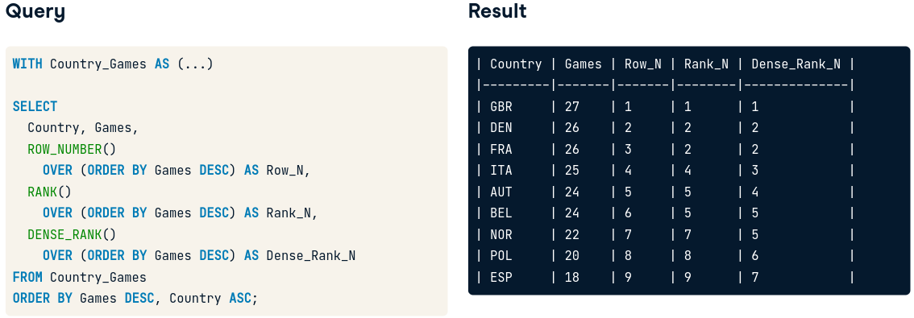

# PostgreSQL Summary Stats and Window Functions

This course covers:

* Introduction to window functions
* Fetching, ranking and paging
* Aggregate window functions and frames
* Beyond window functions

<br />

## Summary

| Keyword | Use |
| ---: | :--- |
| ROW_NUMBER() | window function that adds a index-like column $(n+1)$ |
| LAG(*column*, *n*) | returns *column*'s value *n* rows before the current row. *n* defaults to 1|
<br />

# Introduction to window functions

### Window functions:

* Perform an operation across as et of rows that are somehow related to the 
current row
* Similar to **GROUP BY** aggregate functions, but all rows remain in the output

### Uses:

* Fetch values from preceding or following rows (e.g. fetching the previous row's
value)
* Addign ordinal ranks (1st, 2nd, etc.) to rows based on their values' positions
in a sorted list
* Running totals and moving averages

### Examples:

* ROW_NUMBER() .- adds an index column to the output, i.e. a column that will
follow $n + 1$ algorithm for each row.
* LAG(*column*, *n*) .- returns *column*'s value *n* rows before the current row.
*n* defaults to 1.

```sql
/* Return year, name of the event and athlete's country from summer sports
database for first places*/
SELECT
    ev_year, event_name, country,
    ROW_NUMBER() OVER() AS row_n
FROM summer_medals
WHERE medal = 'Gold';
```

### Anatomy of window function

* FUNCTION_NAME() OVER(...) AS alias
    * OVER(...) can contain statements such as:
        * ORDER BY
        * PARTITION BY
        * ROWS/RANGE PRECEDING/FOLLOWING/UNBOUNDED

## OVER(ORDER BY)

This subclause of OVER, orders the rows related to the current row by one or
more specified fields. 

NOTE: It will order the data automatically just as if the ORDER BY clause was at
the end as long as there's not another ORDER BY clause outside the OVER()
statement.

```sql
/* This query will sort the data by year and event and assign the index
column based on this new order*/
SELECT
    ev_year, event_name, country,
    ROW_NUMBER() OVER(ORDER BY ev_year DESC, event_name) AS row_n
FROM summer_medals
WHERE medal = 'Gold';
```

## OVER(PARTITION BY)

It splits the table into partitions based on a column's unique values, similar
to GROUP BY. We can think of it as an expanded GROUP BY statement.

* PARTITION BY affects the functions we've seen before:
    * ROW_NUMBER() will reset for each partition
    * LAG() will return the same value as the previous row only if it belongs to
    the same partition. 

```sql
/* This query will return the reset the index for each different event*/
SELECT
    ev_year, event_name, country,
    ROW_NUMBER() OVER(
        PARTITION BY event_name
        ORDER BY event_name ASC) AS row_n
FROM summer_medals
WHERE medal = 'Gold';
```

<br />

# Fetching, ranking and paging

## Fetching

There are 2 types of fetching functions: **relative** and **absolute**, the first
one is dependent on the current row, while the second depends on the table or 
partition. 

| Type | Function | Use |
| --- | --- | --- |
| Relative | LAG(*column*, *n*)   | returns row value *n* times before |
| Relative | LEAD(*column*, *n*)  | returns row value *n* times after |
| Absolute | FIRST_VALUE(*column*)| returns first value of table/partition |
| Absolute | LAST_VALUE(*column*) | returns last value of table/partition |

```sql
/* Year and city of event in the first 2 columns, the first and the last 
city of the table in the last 2 columns */
SELECT
    ev_year, city,
    FIRST_VALUE(city) OVER(
        ORDER BY ev_year ASC
    ) AS first_city
    LAST_VALUE(city) OVER(
        ORDER BY ev_year ASC
        RANGE BETWEEN
            UNBOUNDED PRECEDING AND
            UNBOUNDED FOLLOWING
    ) AS last_city
FROM hosts
ORDER BY ev_year ASC
```

Note: By default, the **LAST_VALUE()** will be considered as the current row. The
**RANGE BETWEEN** clause extends the window to the end of the table or partition. 

## Ranking

Ranking window functions *rank rows according to their value*.

| Function | Use |
| --- | --- |
| ROW_NUMBER() | window function that adds a index-like column $(n+1)$ |
| RANK() | similar to the previous, but it assigns the same number to rows with identical values |
| DENSE_RANK() | same as RANK() but it doesn't skip numbers* |

\* RANK() will act exactly as ROW_NUMBER() but it will assign the same value to
rows with the same value, i.e. for a race, if 2 runners got the first place with
the same time they will both have 1st but the runner with the 2nd best time will
be assigned number 3. DENSE_RANK() works this around and assign the 2nd best
time number 2. 

```sql
/*Return gold medalists order by the number of medals with RANK and
DENSE RANK column*/
SELECT 
    athlete, COUNT(medal) AS gold_medals,
    RANK() OVER(ORDER BY COUNT(medal) DESC) AS rank,
    DENSE_RANK() OVER(ORDER BY COUNT(medal) DESC) AS dense_rank,
FROM games
WHERE medal = 'Gold'
ORDER BY gold_medals DESC, athlete;
```

### Example



## Paging

Paging is splitting data into (approximately) equal chunks.

### Use cases

* Many API's return data in "*pages*" to reduce data being sent. 
* Separating data into quartiles or thirds to judge performance, i.e. look at a
specific value and see what chunk it belongs to

| Function | Use |
| --- | --- |
| NTILE(*n*) | splits the data into *n* aproximately equal pages |

This function creates a new column with that indicates to what page each record
would belong to.

```sql
/* Return the athlete list and a column that indicates what page would
they belong to if we splitted the list into 5 */
SELECT 
    DISTINCT athlete,
    NTILE(5) OVER() AS page_number
FROM games
ORDER BY athletes

/* Returns gold medalists and a column that indicates to what quartile they
belong to */
SELECT 
    athlete, COUNT(medal) AS gold_medals
    NTILE(4) OVER() AS quartile
FROM games
WHERE medal = 'Gold'
ORDER BY gold_medals
```

<br />

# Aggregate window functions and frames

## Aggregate window functions

Aggregate functions combined with the OVER() window function allow us to get
cumulative measures such as the MAX() value so far (relative to the current row),
the cumulative SUM(), etc.

```sql
/* Number of medals for each year along with some aggregate functions */
SELECT
    ev_year, medals
    -- Max medals so far
    MAX(medals) OVER(ORDER BY ev_year ASC) AS max_medals,
    -- Average of medals so far
    AVG(medals) OVER(ORDER BY ev_year ASC) AS avg_medals,
    -- Cumulative sum
    SUM(medals) OVER(ORDER BY ev_year ASC) AS avg_medals,
FROM games
ORDER BY ev_year
```

## Frames

By default, a window *frame* starts at the beggining of the table and ends at
the current row. We can change this with the use of **FRAMES**.

### Frame syntax

* ROWS BETWEEN \[START] AND \[FINISH]

    or

* RANGE BETWEEN \[START] AND \[FINISH]

<br />

### ROWS BETWEEN

Start and finish can be one of 3 clauses:

* *n* PRECEDING: *n* rows before the current row
* CURRENT ROW: current row
* *n* FOLLOWING: *n* rows after the current row

This feature can be used to calculate **moving averages** (average of last *n*
periods) and **moving total** (sum of the last *n* periods).

```sql
/* Return the 3 day moving average of the sales by day*/
SELECT 
    date_field,
    amount,
    AVG(amount) OVER(ORDER BY date_field ASC
                    ROWS BETWEEN
                    1 PRECEDING AND 1 FOLLOWING) AS 3_day_moving_average
FROM sales
```

### RANGE BETWEEN

The diffrence with ROWS BETWEEN clause is that:
* RANGE treats duplicates in OVER's ORDER BY subclause as a single entity
* ROWS BETWEEN is almost always used over RANGE BETWEEN