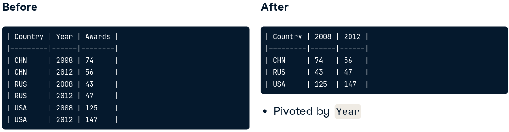
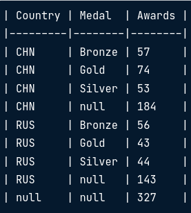
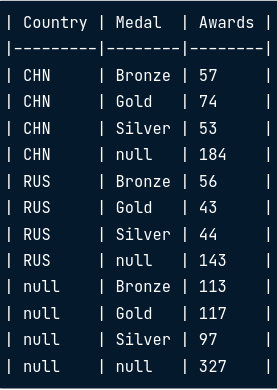

# PostgreSQL Summary Stats and Window Functions

This course covers:

* Introduction to window functions
* Fetching, ranking and paging
* Aggregate window functions and frames
* Beyond window functions

<br />

## Summary

| Keyword | Use |
| ---: | :--- |
| ROW_NUMBER() | window function that adds a index-like column $(n+1)$ |
| LAG(*column*, *n*) | returns *column*'s value *n* rows before the current row. *n* defaults to 1|
| LEAD(*column*, *n*) | works as LAG but goes *columns after* instead of columns before |
| OVER() | statement used to add partitions and/or order by to the window functions |
| PARTITION BY | breaks the aggregate function by the values in some field |
| FIRST_VALUE() | Returns the first value of a table/partition |
| LAST_VALUE() | Returns the last value of a table/partition |
| ROW_NUMBER() | window function that adds a index-like column $(n+1)$ |
| RANK() | similar to the previous, but it assigns the same number to rows with identical values |
| DENSE_RANK() | same as RANK() but it doesn't skip numbers* |
| NTILE(*n*) | splits the data into *n* aproximately equal pages |
| ROWS BETWEEN *arg* AND *arg* | used to set up the window, can take as *arg*: *n* PRECEDING; CURRENT ROW; *n* FOLLOWING
| CROSSTAB | used for pivoting columns (see details below) |
| ROLLUP | GROUP BY subclause, allows to include extra rows for group-level aggregations |
| CUBE | similar to ROLLUP but it generates all possible group-level aggregations |
| COALESCE(*column*, *string*) | replaces the null values in a *column* by a given *string* |
| STRING_AGG(*column*, *sep*) | returns the values of a *column* in a single line, the values are separated by a given separator *sep*


<br />

# Introduction to window functions

### Window functions:

* Perform an operation across as et of rows that are somehow related to the 
current row
* Similar to **GROUP BY** aggregate functions, but all rows remain in the output

### Uses:

* Fetch values from preceding or following rows (e.g. fetching the previous row's
value)
* Addign ordinal ranks (1st, 2nd, etc.) to rows based on their values' positions
in a sorted list
* Running totals and moving averages

### Examples:

* ROW_NUMBER() .- adds an index column to the output, i.e. a column that will
follow $n + 1$ algorithm for each row.
* LAG(*column*, *n*) .- returns *column*'s value *n* rows before the current row.
*n* defaults to 1.

```sql
/* Return year, name of the event and athlete's country from summer sports
database for first places*/
SELECT
    ev_year, event_name, country,
    ROW_NUMBER() OVER() AS row_n
FROM summer_medals
WHERE medal = 'Gold';
```

### Anatomy of window function

* FUNCTION_NAME() OVER(...) AS alias
    * OVER(...) can contain statements such as:
        * ORDER BY
        * PARTITION BY
        * ROWS/RANGE PRECEDING/FOLLOWING/UNBOUNDED

## OVER(ORDER BY)

This subclause of OVER, orders the rows related to the current row by one or
more specified fields. 

NOTE: It will order the data automatically just as if the ORDER BY clause was at
the end as long as there's not another ORDER BY clause outside the OVER()
statement.

```sql
/* This query will sort the data by year and event and assign the index
column based on this new order*/
SELECT
    ev_year, event_name, country,
    ROW_NUMBER() OVER(ORDER BY ev_year DESC, event_name) AS row_n
FROM summer_medals
WHERE medal = 'Gold';
```

## OVER(PARTITION BY)

It splits the table into partitions based on a column's unique values, similar
to GROUP BY. We can think of it as an expanded GROUP BY statement.

* PARTITION BY affects the functions we've seen before:
    * ROW_NUMBER() will reset for each partition
    * LAG() will return the same value as the previous row only if it belongs to
    the same partition. 

```sql
/* This query will return the reset the index for each different event*/
SELECT
    ev_year, event_name, country,
    ROW_NUMBER() OVER(
        PARTITION BY event_name
        ORDER BY event_name ASC) AS row_n
FROM summer_medals
WHERE medal = 'Gold';
```

<br />

# Fetching, ranking and paging

## Fetching

There are 2 types of fetching functions: **relative** and **absolute**, the first
one is dependent on the current row, while the second depends on the table or 
partition. 

| Type | Function | Use |
| --- | --- | --- |
| Relative | LAG(*column*, *n*)   | returns row value *n* times before |
| Relative | LEAD(*column*, *n*)  | returns row value *n* times after |
| Absolute | FIRST_VALUE(*column*)| returns first value of table/partition |
| Absolute | LAST_VALUE(*column*) | returns last value of table/partition |

```sql
/* Year and city of event in the first 2 columns, the first and the last 
city of the table in the last 2 columns */
SELECT
    ev_year, city,
    FIRST_VALUE(city) OVER(
        ORDER BY ev_year ASC
    ) AS first_city
    LAST_VALUE(city) OVER(
        ORDER BY ev_year ASC
        RANGE BETWEEN
            UNBOUNDED PRECEDING AND
            UNBOUNDED FOLLOWING
    ) AS last_city
FROM hosts
ORDER BY ev_year ASC
```

Note: By default, the **LAST_VALUE()** will be considered as the current row. The
**RANGE BETWEEN** clause extends the window to the end of the table or partition. 

## Ranking

Ranking window functions *rank rows according to their value*.

| Function | Use |
| --- | --- |
| ROW_NUMBER() | window function that adds a index-like column $(n+1)$ |
| RANK() | similar to the previous, but it assigns the same number to rows with identical values |
| DENSE_RANK() | same as RANK() but it doesn't skip numbers* |

\* RANK() will act exactly as ROW_NUMBER() but it will assign the same value to
rows with the same value, i.e. for a race, if 2 runners got the first place with
the same time they will both have 1st but the runner with the 2nd best time will
be assigned number 3. DENSE_RANK() works this around and assign the 2nd best
time number 2. 

```sql
/*Return gold medalists order by the number of medals with RANK and
DENSE RANK column*/
SELECT 
    athlete, COUNT(medal) AS gold_medals,
    RANK() OVER(ORDER BY COUNT(medal) DESC) AS rank,
    DENSE_RANK() OVER(ORDER BY COUNT(medal) DESC) AS dense_rank,
FROM games
WHERE medal = 'Gold'
ORDER BY gold_medals DESC, athlete;
```

### Example


## Paging

Paging is splitting data into (approximately) equal chunks.

### Use cases

* Many API's return data in "*pages*" to reduce data being sent. 
* Separating data into quartiles or thirds to judge performance, i.e. look at a
specific value and see what chunk it belongs to

| Function | Use |
| --- | --- |
| NTILE(*n*) | splits the data into *n* aproximately equal pages |

This function creates a new column with that indicates to what page each record
would belong to.

```sql
/* Return the athlete list and a column that indicates what page would
they belong to if we splitted the list into 5 */
SELECT 
    DISTINCT athlete,
    NTILE(5) OVER() AS page_number
FROM games
ORDER BY athletes

/* Returns gold medalists and a column that indicates to what quartile they
belong to */
SELECT 
    athlete, COUNT(medal) AS gold_medals
    NTILE(4) OVER() AS quartile
FROM games
WHERE medal = 'Gold'
ORDER BY gold_medals
```

<br />

# Aggregate window functions and frames

## Aggregate window functions

Aggregate functions combined with the OVER() window function allow us to get
cumulative measures such as the MAX() value so far (relative to the current row),
the cumulative SUM(), etc.

```sql
/* Number of medals for each year along with some aggregate functions */
SELECT
    ev_year, medals
    -- Max medals so far
    MAX(medals) OVER(ORDER BY ev_year ASC) AS max_medals,
    -- Average of medals so far
    AVG(medals) OVER(ORDER BY ev_year ASC) AS avg_medals,
    -- Cumulative sum
    SUM(medals) OVER(ORDER BY ev_year ASC) AS avg_medals,
FROM games
ORDER BY ev_year
```

## Frames

By default, a window *frame* starts at the beggining of the table and ends at
the current row. We can change this with the use of **FRAMES**.

### Frame syntax

* ROWS BETWEEN \[START] AND \[FINISH]

    or

* RANGE BETWEEN \[START] AND \[FINISH]

<br />

### ROWS BETWEEN

Start and finish can be one of 3 clauses:

* *n* PRECEDING: *n* rows before the current row
* CURRENT ROW: current row
* *n* FOLLOWING: *n* rows after the current row

This feature can be used to calculate **moving averages** (average of last *n*
periods) and **moving total** (sum of the last *n* periods).

```sql
/* Return the 3 day moving average of the sales by day*/
SELECT 
    date_field,
    amount,
    AVG(amount) OVER(ORDER BY date_field ASC
                    ROWS BETWEEN
                    1 PRECEDING AND 1 FOLLOWING) AS 3_day_moving_average
FROM sales
```

### RANGE BETWEEN

The diffrence with ROWS BETWEEN clause is that:

* RANGE treats duplicates in OVER's ORDER BY subclause as a single entity
* ROWS BETWEEN is almost always used over RANGE BETWEEN

<br />

# Beyond window functions

## Pivoting

Switch columns to rows; *vetical to horizontal structure*. For example, getting
the years in the year field to columns so that each column is a year to study
chronological data. 

We can acheve this with the **CROSSTAB** function and the **CREATE extension**
statement. Following this syntax:

```sql
CREATE EXTENSION IF NOT EXISTS tablefunc;

SELECT * FROM CROSSTAB($$
    -- source_sql TEXT
$$) AS ct (column_1 DATA_TYPE_1,
           column_2 DATA_TYPE_2,
           ...,
           column_n DATA_TYPE_n)
```

### Example

```sql
/* Before pivoting */
SELECT
    country, year, count(*) AS awards
FROM summer_medals
WHERE
    country IN ('CHN', 'RUS', 'USA')
    AND year IN (2008, 2012)
    AND medal = 'gold'
GROUP BY country, year
ORDER BY country ASC, year ASC;

/* After pivoting */
CREATE EXTENSION IF NOT EXISTS tablefunc;

SELECT * FROM CROSSTAB($$
    SELECT
        country, year, count(*) AS awards
    FROM summer_medals
    WHERE
        country IN ('CHN', 'RUS', 'USA')
        AND year IN (2008, 2012)
        AND medal = 'gold'
    GROUP BY country, year
    ORDER BY country ASC, year ASC;
$$) AS ct (country VARCHAR, 
           "2008" INTEGER, 
           "2012" INTEGER)

ORDER BY country ASC
```



### Complete example with all we've learned so far

```sql
CREATE EXTENSION IF NOT EXISTS tablefunc; -- Pivot first step

SELECT * FROM CROSSTAB($$
  WITH Country_Awards AS (                -- CTE
    SELECT
      Country,
      Year,
      COUNT(*) AS Awards
    FROM Summer_Medals
    WHERE
      Country IN ('FRA', 'GBR', 'GER')
      AND Year IN (2004, 2008, 2012)
      AND Medal = 'Gold'
    GROUP BY Country, Year)

  SELECT
    Country,
    Year,
    RANK() OVER                           -- Window function
      (PARTITION BY Year
       ORDER BY Awards DESC) :: INTEGER AS rank
  FROM Country_Awards
  ORDER BY Country ASC, Year ASC;
$$) AS ct (Country VARCHAR,               -- Pivot end
           "2004" INTEGER,
           "2008" INTEGER,
           "2012" INTEGER)

Order by Country ASC;
```

## ROLLUP and CUBE

### ROLLUP

**ROLLUP** is a **GROUP BY** subclause that includes extra rows for group-level
aggregations, i.e., we can get multiple group by data in the same query.

* **ROLLUP** can also be used to generate grand totals
* it is hierarchical, the order on which we pass the fields affects the ouput

```sql
/*Get number of medals by country and by medal (gold, silver, bronze)
showing count by country/medal and also country total (medal will be
null for that record*/
SELECT
    country, medal, count(*) AS awards
FROM summer_medals
WHERE 
    ev_year = 2008 AND country IN ('CHN', 'RUS')
GROUP BY ROLLUP (country, medal)
ORDER BY country ASC, medal ASC;
```



NOTE that null represent country-level totals. To get medal level totals instead
we would use ROLLUP(medal, country).

### CUBE

If we also wanted medal level totals we'd use **CUBE**. The difference with 
**ROLLUP** is that it generates *all possible group-level aggregations*. It will
generate at the bottom the subtotals for the other fields. 

```sql
/*Same query as before but with county and medal level subtotals*/
SELECT
    country, medal, count(*) AS awards
FROM summer_medals
WHERE 
    ev_year = 2008 AND country IN ('CHN', 'RUS')
GROUP BY CUBE (country, medal)
ORDER BY country ASC, medal ASC;
```



# Useful functions

## COALESCE

* Used to handle *null* records such as the ones remaining after using ROLLUP
and CUBE.
* Stated in the **SELECT** clause
* Syntax: 
    * **COALESCE**(*field_name*, *'string_for_nulls'*) **AS** *field_name*
* It replaces null values in a column by a given string

## STRING_AGG

* Used to return column values in a single row separated by a given character
* Stated in the **SELECT** clause
* Syntax:
    * STRING_AGG(field_name, 'separator_char')

```sql
/*Same query as before but null values will be replaced*/
SELECT
    COALESCE(country, 'Both countries') AS country
    COALESCE(medal, 'All medals') AS medal
    count(*) AS awards
FROM summer_medals
WHERE 
    ev_year = 2008 AND country IN ('CHN', 'RUS')
GROUP BY CUBE (country, medal)
ORDER BY country ASC, medal ASC;

---------------------------------------------------------

/* Return a sorted list of countries*/
SELECT
    STRING_AGG(country, ', ')
FROM countries
ORDER BY country, ASC

-- OUTPUT: Argentina, Brazil, Mexico, USA
```