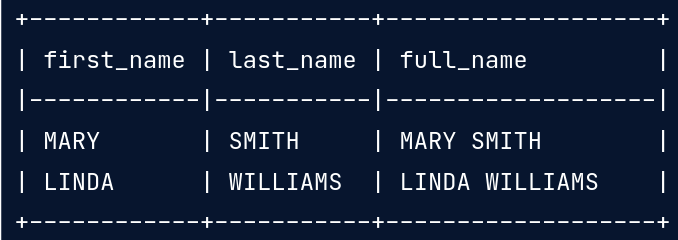

# Functions for manipulating data in PostgreSQL

This course covers:

* Data types
* Date/time functions and operators
* Parsing and manipulating text
* Full-text searching and PostgreSQL Extensions

<br />

## Summary

| Keyword | Use |
| ---: | :--- |
|WHERE 'search text' = ANY(array_name)| check if an item ('search text') is in an array |
| WHERE array_name @> ARRAY['search text'] :: type[] | chec if an array CONTAINS an item. Same result as ANY() |
| AGE(ts1, ts2) | Returns INTERVAL between 2 TIMESTAMPS (ts1 and ts2) |
| CAST(value AS data_type) | convert to other data type |
| EXTRACT(filed FROM source) | Returns part of a date (quarter, year, day of the week, etc.) |
| DATE_PART('field', source) | Returns part of a date (quarter, year, day of the week, etc.) |

<br />

## Common data types

| Type | Description | Example |
| --- | --- | --- |
| CHAR(n) | fixed-length, blank padded | *n=2*: ```y ```, ```hi``` |
| VARCHAR(n) | variable-length with length limit | *n=4*: ```hi```, ```four``` |
| TEXT, VARCHAR | variable unlimited length | ```there is no lenght limit``` |
| INT |||
| DECIMAL |||
| DATE | date value from TIMESTAMP | ```2019-03-26``` |
| TIME | time value from TIMESTAMP | ```01:05:17``` |
| TIMESTAMP | date +  time + microsecond (ISO 8601 format) | ```2016-06-22 19:10:25``` |
| TIMESTAMPTZ |  timestamp + timezone | ```2016-06-22 22:10:25-04``` |
| INTERVAL | stores time values (days, hours, minutes, etc.) used for operations on date/time datatypes | ```'4 days'``` |
| Arrays | multi-dimensional arrays of varying length for any data type | ```{"array", "of", "text"}```, ```{1, 2, 3, 5}```|
| UPPER(example) | turns text to upper case | ```UPPER('hello'): HELLO``` |
| LOWER(example) | turns text to lower case | ```LOWER('HELLO'): hello``` |
| INITCAP(example) | turns text to title case | ```INITCAP('HELLO there'): Hello There``` |
| REPLACE(text, 'substring', 'replacement') | Gets a text column and replaces a substring for a replacement string in the result | ```REPLACE(txt, 'hello', 'hi'): hi there``` ||
| REVERSE(text) | returns the text reversed | ```REVERSE('Hello'): olleH``` |
| CHAR_LENGTH(text) | returns the text length | ```CHAR_LENGTH('hi'): 2``` |
| LENGTH(text) | returns the text length; same as above | ```LENGTH('hi'): 2``` |
| POSITION('c' IN text) | returns the position of character 'c' in the *text* | ```POSITION('e' IN 'hello'): 2``` |
| LEFT(text, n) & RIGHT(text, n) | extracts the left or right *n* of a text | ```LEFT('hello', 2): he``` |
| SUBSTRING(text, n, m) | extracts a substring of size **m** from a text, starting from character in position **n** | |
| TRIM('  text  ') | removes characters from text |  ```TRIM('  text '): 'text'``` |
| LPAD(string, length, char) | fills a string to meet a length; it uses whitespace by default but character can be specified | ```LPAD('hi', 5, #): 'hi###'``` |

### Exploring the database throug the INFROMATION_SCHEMA

We can get information about the tables and columns from the INFORMATION_SCHEMA
table in PostgreSQL.

```sql
-- get tables from the database
SELECT *
FROM INFORMATION_SCHEMA.TABLES

-- get columns information
SELECT *
FROM INFORMATION_SCHEMA.COLUMNS
```

### Arrays

Important notes about arrays in SQL:

```sql
-- create array type column
CREATE TABLE example (
    int_array int[],
    nested_text_array text[][]
)

-- add records
INSERT INTO example
    VALUES (
        '{1, 2, 4, 8, 16}',
        '{{"item 1", "first text"}, {"item 2", "another text"}}'
    )

-- access array
SELECT
    int_array[1]
    nested_text_array[1][1] AS item,
    nested_text_array[1][2] AS arr_text
FROM example

-- filtering
SELECT
    nested_text_array[1][1] AS item,
    nested_text_array[1][2] AS arr_text
FROM example
WHERE 'item 1' = ANY(nested_text_array) -- 'item 1' is an item in the array
    OR nested_text_array @> ARRAY['item 1'] -- 'contains', same result
```
**NOTE**: index starts at 1

## DATE/TIME functions and operators

### Arithmetic operations and casting

* When working with DATE values, the results will be integers, representing
days. Likewise, if you add an integer to a DATE it will **sum a day**.
* When doing it with TIMESTAMP values, we get an INTERVAL as a result. The
AGE() function returns the difference (INTERVAL) between two TIMESTAMPS

```sql
-- sum days to a DATE using INT column
SELECT date_col, int_col
    date_col + INTERVAL '1' day * int_col
...

-- get current date/time
SELECT NOW() --returns with microsecond precision and timezone
-- cast to date/time without timezone
SELECT CAST(NOW() AS timestamp);

-- get current date
SELECT CURRENT_DATE
-- get current time
SELECT CURRENT_TIME
```

### Getting part of a date

To get only year, month, day, day of the week, etc. from a date, we can
use the EXTRACT() and DATE_PART() functions.

We can also use the DATE_TRUNC() function to truncate a date to the specified
paramter.

```sql
SELECT EXTRACT(quarter FROM timestamp '2005-01-24 05:12:00') AS qtr;
SELECT DATE_PART(quarter, timestamp '2005-01-24 05:12:00') AS qtr;
-- result: 1

SELECT DATE_TRUNC('year', timestamp '2005-05-24 05:12:00')
-- result: 2005-01-01 00:00:00
SELECT DATE_TRUNC('month', timestamp '2005-05-24 05:12:00')
-- result: 2005-05-01 00:00:00
```

<br/>

## Manipulating text

### Concatenate

To concatenate text we can use the *pipe operator* (```||```).

```sql
-- concatenate
SELECT
    first_name,
    last_name,
    first_name || ' ' || last_name AS full_name
FROM names
```


### Manipulation

There are also the following functions to alter text (taking the text column
as paramenter):

* ```UPPER()```.- turns text into *UPPER CASE*
* ```LOWER()```.- turns text into *lower case*
* ```INITCAP()```.- turns text into *Title Case*
* ```REVERSE()```.- reverses the *text : txet*
* ```REPLACE(text, substring, replacement)```.- in the text column, it replaces
the substring by the replacement

### Indexing, truncating, replacing and overwriting

There are also some functions to split and index strings (mentioned in the
summary). They can be used together to create complex queries such as the
following:

```sql
-- get text before @
SELECT
    SUBSTRING(email FROM 0 FOR POSITION('@' IN email))
FROM customer;

-- get text after @
SELECT
    SUBSTRING(email FROM POSITION('@' IN email)+1 FOR CHAR_LENGTH(email))
FROM customer;
```

#### TRIM

The TRIM function takes as parameters the following ```TRIM([leading | trailing | both] [characters] FROM string)```, where:

* ```[leading | trailing | both]```: Remove characters from either the start,
end, or both; respectively
* ```[characters]```: Specifies wich characters will be removed from the string
* ```string```: string to trim

The default behaivior (only the string parameter) will remove blank spaces from
both sides.

Ther are also the functions ```LTRIM()``` and ```RTRIM()``` wich remove characters
at the left or right respectively.

#### PAD

Structure ```LPAD(string, length, char)``` makes the string of the specified
lenght by filling the needed spaces with the specified char. If not specified,
char will be whitespace.

* ```LPAD()```: adds characters to the left
* ```RPAD()```: adds characters to the right

NOTE: if the string is larger than the length, it will be truncated.

## FULL-TEXT SEARCH

Full text search provides a means for performing natural language queries of
text data in your database by using:

* Stemming
* Fuzzy string matching to handle spelling mistakes
* And a mechanism to rank results by similarity to the search string

It basically vectorizes the text to improve the search with NLP. It has advantages
over using the LIKE opeartor, for example, it ignores casing and it also is better
performance-wise.

To use it, first we need to convert a string to a vector using ```TO_TSVECTOR()```.

```sql
-- Creating tsvector
SELECT TO_TSVECTOR(col)
FROM db

-- text search with full text
SELECT title, description
FROM film
WHERE TO_TSVECTOR(title) @@ TSQUERY('elf'); -- contains substring elf
```

## PostgreSQL Extensions

Here are the commonly used extensions:

* PostGIS: Allows location queries to be run in SQL
* PostPic: Allows for image procesing within the database
* fuzzystrmatch and pg_trgm: Provide functions that extend full-text search
capabilities by finding similarities between the strings.

We can check available extensions, as well as already installed extensions using:

```sql
-- Available extensions
SELECT name
FROM pg_available_extensions;

-- Installed extensions
SELECT name
FROM pg_installed_extensions;

-- Enable extension
CREATE EXTENSION IF NOT EXISTS fuzzystrmatch;
-- Confirm that it has been enabled
SELECT extname FROM pg_extension;
```

### Functions from fuzzystrmatch and pg_trgm

The ```levenshtein``` returns the number of changes that a string would require to
match another given string.

The ```similarity``` function from pg_trgm compares strings using trigram
matching, wich means 3 consecutive characters. It will return a number between
0 and 1, 1 being a perfect match.

```sql
/*fuzzystrmatch*/
SELECT levenshtein('GUMBO', 'GAMBOL')
-- 2

/*pg_trgm*/
SELECT similarity('GUMBO', 'GAMBOL')
-- 0.18181818
```