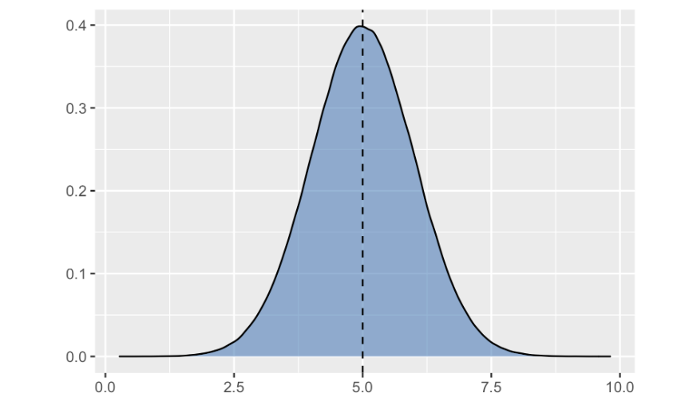
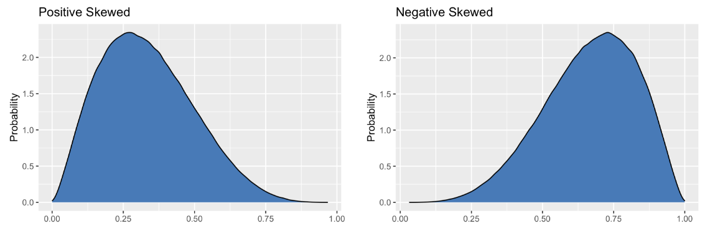
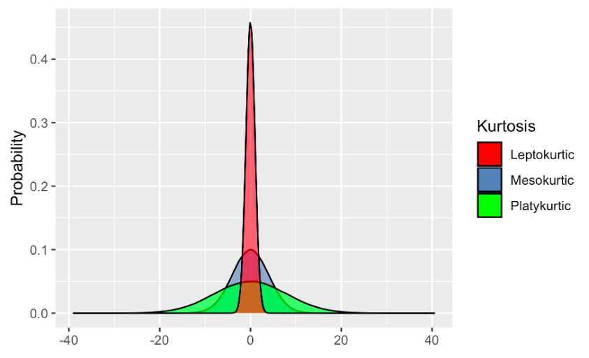
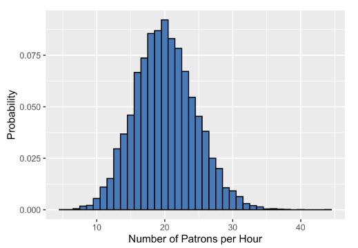
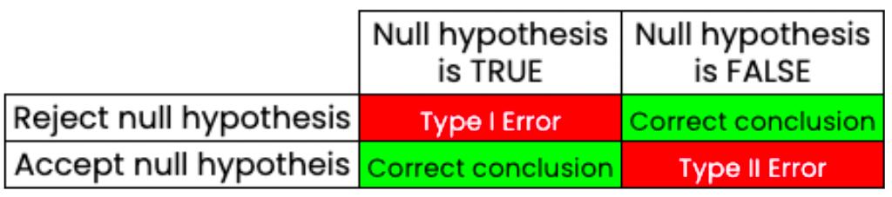

# Introduction to statistics

## Intro

**Statistics**.- practice and study of collecting and alayzing data. 

### Branches of statistics
* **Descriptive/Summary Statistics:** *Describe* or *summarize* data;
**population**
* **Inferential Statistics:** Use a sample to *draw conclusions* about a 
population; **sample**

 

### Types of data

* **Numeric**:
    
    * Continious. - FLOAT; measured on a continious scale
    * Interval/count data. - INT; measured in whole numbers

* **Categorical**
    
    * Nominal Data. - describes unordered categories (ex. eye color)
    * Ordinal Data. - follow an order (ex. opinions: bad - good)

 
 

## Measures of center

Describe the central tendency; the typical central value in the distribution. 

| Measure | Formula | Description |
| --- | --- | --- |
| mean | $$\mu = \frac{1}{n} \sum_{i=i}^{n} x_{i}$$ | gives the average of values, use for normal distribution *i.e.* when the data is symetrical |
| median | $$\frac{middle\;value(s)}{number\;of\;middle\;values}$$ | middle value of the data (sorted), use for non-symetrical data or when there are outliers|
| mode | | most frequent value|

 

## Measures of spread

Spread describes how far apart datapoints are. 

| Measure | Formula | Description | 
| --- | --- | --- | 
| range | $$max - min$$ | maximum and minimum values |
| variance| $$\sigma^2 = \frac{\displaystyle\sum_{i=1}^{n}(x_i - \mu)^2} {n}$$| average distrance from each datapoint to the mean in squared units (to get rid of negatives) |
| standard deviation | $$\sigma = \sqrt{\sigma²}$$ | way of reverting the square transformation of the variance, average distance between datapoints and mean |
| quartiles | $$Q_i$$ | splits the information into four equal parts | 
| interquartile range| $$Q_3 - Q_1$$| distance between the 1st and 3rd quartile; this measure is less affected by extreme values |

 

## Probability and distributions

### Probability of an event: 

$P(event) = \frac{number\;of\;ways\;the\;event\;can\;happen}
{total\;number\;of\;possible\;outcomes}$

$0 \leq P \leq 1$

### Conditional probability

Used for sampling without replacement, which occurs when events are dependent 
*i.e.* the outcome of a first event influence in the second. 

$P(A|B) = \frac{P(A \cap B)}{P(B)}$

### Types of distributions

* **Discrete distributions:** categorical; it's one in which data can only take 
on certain values. 
* **Continious distributions:** numerical; one in which data can take on any 
value within a specified range. 

### Binomial distribution

It's the probablility distribution of the **number of successes** in a *sequence* 
of **independent events**; for example, number of heads in a sequence of coin
flips. 

It is described by *n* and *p*, where:
* *n* = total number of events
* *p* = probability of success

It can be used for **independent events** producing **binary outcomes**. 

### Expected value
$Expected\;value = n * p$

 

## Normal distribution

Graph looks like a bell curve. 

Properties:
* Symetrical
* Probability never hits zero
* Described by its mean and standard deviation
    * $1*\sigma \pm \mu = $ **68%** of the distribution
    * $2*\sigma \pm \mu = $ **95%** of the distribution
    * $3*\sigma \pm \mu = $ **99.7%** of the distribution

It's important because many real world data resembles a normal distribution. 
Also because for many statistical tests it is required. 

### Skewness

Describes the direction where the data tails off.

### Kurtosis

A way of describing hte ocurrence of extreme values in a distribution. There 
are three types of kurtosis:
* Leptokurtic $excess\;kurtosis > 0$
* Mesokurtic $excess\;kurtosis = 0$
* Platikurtic $excess\;kurtosis < 0$

### Central limit theorem

The sampling distribution of a statistic becomes closer to the normal
 distribution as the size of the sample increases. 

 It only aplies when the samples are taken randomly and are independent. 

 

## Poisson distribution

**Poisson process:** when an average number of events in a preiod is known but 
the time or space between the events is random. Examples:

* Number of animals adopted from an animal shelter per week
* Number of people arriving at a restaurant per hour
* Number of website visits in a day

**Poisson distribution:** describes the probability of some numbers of events 
ocurring over a fixed period of time. Examples:

* Probability of at least 5 animals adopted from an animal shelter in a week
* Probability of 12 people arriving at a restaurant per hour
* Probability of less than 200 visits to a website in a day

### Lambda $\lambda$

The Poisson distribution is described by lambda ($\lambda$), which represents 
the average number of events per time period. 

Graphically speaking, **lambda is the distribution's peak**. In the example 
below, lamda would have a value of 20 since it's the most likely value to ocurr. 

 

## Hypothesis testing

There are two parts to hypothesis testing:

* **Null Hypothesis:** assumes that any events, relationships, or anything else
 is null
* **Alternative Hypothesis:** says the contraty to the null hypothesis, the 
alternative hypothesis is usually what we're trying to prove

### Hypothesis testing workflow

1. Define target populations
2. Develop null and alternative hypothesis
3. Collect or access sample data
4. Perform statistical tests on the sample data
5. Draw conclusions about the population

### Independent and dependent variables

In hypothesis testing we define the data in terms of the difference we expect to
observe in the alternate hypothesis. 

* **Independent variable:** describes the data that we expect not to be affected
by other data
* **Dependet variables:** the data we expect to be affected by other variable

 

## Correlation

Relationship between variables. 

### Pearson correlation coefficient ($r$)

* Quantifies the strength of a relationship between two variables
* $-1 \leq r \leq 1$
* $r$ corresponds to the strength of the relationship
* The sign (+ or -) corresponds to the direction of the relationship

NOTE: The pearson relationship *can only be used for linear relationships*, 
where changes between variables are proportional. 

### Hypothesis test results interpretation

### **p-value**

When drawing conclusions in hypothesis testing we use a metric called a 
*p-value* ($p$).

$p =$ probability of achieving a result at least as extreme as the one we 
observed for our alternative hypothesis, assuming the null hypothesis is true. 

### Significance level ($\alpha$)

* Used to set a probability threshold for rejecting the null hypothesis. 
* The *p-value* should be smaller than $\alpha$ for the alternative hypothesis
to be accepted. 
    * if $p \leq \alpha$, reject the null hypothesis. 

### Error types

There can be two types of errors when drawing a conclusion.

